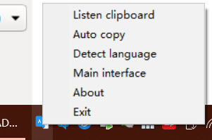
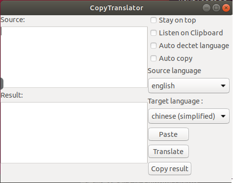

CopyTranslator 


[](https://badge.fury.io/py/CopyTranslator)

[](https://saythanks.io/to/agentzheng)
=== 

Copy, Translate, and Paste with Google translate API.
## Warning, the readme file is out of date.
The code version is 0.0.3. Please contact me at [admin@hypercube.top](mailto:admin@hypercube.top) to get latest release.
## Get started
### Environment
- Python 2.7 or Python 3 and higher
### Requirements
**Only windows can automatically install `wxpython` using `pip`, in other OS you need to install `wxpython` manually.**
#### Windows

- pip 

In windows, pip can help install all the install requirements.
#### Unbuntu or other Linux release with GUI
- pip
- wxpython
- xclip

In linux, `wxpython` can't be installed using pip, and we need `xclip` to help `pyperclip` work.

Here are the example to install the requirements
```shell
sudo apt-get install python-wxtools 
sudo apt-get install xclip
```
For more information, refer to the installation of `wxpython` and `pyperclip`

#### OS X
- wxpython
- pip

In OS X, `wxpython` can't be installed using pip.

Please refer to the installation of `wxpython`.

One possible way is to install `wxpython` in OS X using `homebrew`

```shell
brew install wxpython
```

### Setup

There are 2 ways to install `CopyTranslator` , **you can get latest features if you install from source.**

### Install this Application using `pip`:

```shell
pip install CopyTranslator
```

### Install from source 

1. `git clone https://github.com/elliottzheng/CopyTranslator.git`
2. `cd CopyTranslator`
3. `python setup.py install`

For windows user, after clone the repository to local, you can just double click at the `install.bat` to install, and `start.bat` to start the CopyTranslator.

### Pre build version for Windows 10
Contact me to get latest build.

## Example usage

Run shell command
```shell
CopyTranslator
```
**For Windows users**, you can use command below instead to free yourself from console.
```cmd
CopyTranslator_win
```
## Screenshots
### Windows 10




### Unbuntu



## Acknowledgements

Thanks to the developers of [wxpython](https://wxpython.org/), [googletrans](https://github.com/ssut/py-googletrans), [pyperclip](https://github.com/asweigart/pyperclip) and my dear schoolmates.

## License

The code is licensed under Mozilla Public License 2.0. For more details, read the [LICENSE](./LICENSE) file.
