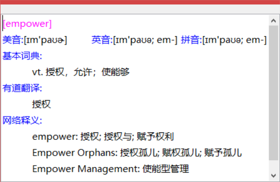

# CopyTranslator 

[中文 Chinese](README_zh.md)

**Foreign language assisted reading and translation solution**

**Please update to latest version as soon as possible. This is a new version that you have never experienced before. Trust me, you will fall in love with it within minutes.**

**If you found it helpful to you, no need to follow or fork, just give me a star and recommend it to your friends around you.**

(Online translation resources come from the Internet, copyright belongs to related websites, and this software is only for academic usage.)

**This software is free and open source. If you find someone selling this software , please report it in the Issue.**

:heart: Like this project? Support me on <a href="https://afdian.net/@elliottzheng/plan" target="_blank">Afdian</a>

## Introduction

### Foreword

Researchers always have to read a lot of literature, and understanding the content of the literature has become the norm in scientific research life. However, when we copy the PDF content and paste it into the webpage translation, there may be extra line breaks that lead to garbled translation, and the translation does not match the Chinese reading habits. The translation results are very poor and  you need to manually delete the line break, and `CopyTranslator` can help us solve this problem quickly and perfectly.

Just open the `CopyTranslator` and copy the PDF text to clipboard,  `CopyTranslator` will watch the clipboard changes, then it will process the clipboard contents (such as removing extra line breaks, etc.) and display the translation results. The translation effect is greatly improved compared to the direct copy and paste to the web version of the translation, and the time required for translation is greatly reduced. With the powerful Google translation API, the translation quality is guaranteed. There are also a wealth of options you can set, such as automatically copy translation results to the clipboard, [Incremental Copy](#Incremental-Copy), [Smart Translation](#Smart-Translation), etc., it effectively improve people's reading and translation efficiency of foreign literature.

**After several iterations, `CopyTranslator` has became more and more powerful as well as user-friendly. It is recommended to read the full [User Manual](https://copytranslator.github.io/guide/) to make best use of it**.

### Core usage

**Open a webpage/PDF, select the text to be translated, copy the text to the clipboard, `CopyTranslator` will listens to the clipboard change, and  process the clipboard content (such as removing extra line breaks, etc.), translate it, and display**.  Just copy the text,`CopyTranslator` will immediately give the translation result, effectively improving your work efficiency.**

## Features

### Copy=Translate

**Greatly simplify the steps required for translation**, just copy the text to the clipboard, and wait to view the translation results in the next second, enjoy the WYSIWYG pleasure, and we also have the [Tap to Copy](#tap-to-copyexperimental) mechanism , making it easier for you to copy text.

### Solve the problem of PDF copy translation

`CopyTranslator` is specifically optimized for English and Chinese pdf line breaks and sentence endings, basically solving the problem caused by extra sentence breaks and line breaks. The following figure shows the translation results using `CopyTranslator`. It's obvious that the translation effect is greatly improved compared to directly copy and paste to the online translator. At the same time, with the powerful google translation API, the translation quality is guaranteed, and the translation.google.cn used is also faster to connect, no need to worry about network problems.

### Multi segments Co-translation

More efficient, while keeping the original segment as much as possible.

### Powerful Focus Mode

Unparalleled powerful focus mode, while it's just a simple text box, it can meet the needs of 90% of daily translation!

- **The translation is displayed in the `Focus mode` and `Contrast Mode` at the same time**. 
- **The result of [Smart Dictionary](#Smart-Dictionary) is only displayed in `Focus Mode`, colorful text helps you quickly distinguish between items**.
- **Drag text to focus mode box, you can get translation results directly**.
- **When the cursor is in the focus mode result box, `Ctrl+Enter` to translate the contents of the box, `Ctrl+B` to use Baidu to search the contents of the box, and `Ctrl+G` to use Google to search the contents of the box**.
- **The right-click menu of `Focus mode` can be used to set up almost all options as well as all the function**.

### Smart Translation

`CopyTranslator` will automatically recognize the copied text, **intelligently translate according to the set`source language` and `target language`**, for example, set `source language` to English,and the ` target language` to be Simplified Chinese. If you copy English, it will be translated into Chinese, and if you copy Chinese, it will be translated into English. 

### Smart Dictionary

For phrase or word, you will see a more detailed explanations in `Focus Mode`. 

### Incremental Copy

Append the copied text to the source other than replace it, **especially useful when the paragraph is separated in different page.** Check the `Incremental Copy ` option to enable it.

### Dual Mode Free Switching to Cope with Different Scenes

- The `Contrast Mode` is in accordance with the user's previous usage habits, and the original text is displayed against the translation.
- `Focus mode` only provides a translation window for you to follow the translation. When using the focus mode, please check the `Stay on top` and `Listen Clipboard`. Check the `Auto copy` if necessary, 

### Customization
- Interface style, font, background and other styles can be easily customized.
- Customizible Global Hotkey
- Vast interface language to choose from and you are able to create or download locale language files.

### Other features

- Support for rich languages, `CopyTranslator` support whatever Google translation supports.
- Many automated customization options are available, such as `Auto Copy`, `Config Memorization`, `Auto Hide`, `Auto Display`.
- There will be more new features in`CopyTranslator` , so stay tuned.

Please refer to the [Documentation](https://copytranslator.github.io) to learn more about `CopyTranslator`

## User Manual/Documentation/Homepage

Link: [User Manual](https://copytranslator.github.io/guide/)

## Download/Install

Link: [Install Guide](https://copytranslator.github.io/download/)

**After several iterations, `CopyTranslator` has became more and more powerful as well as user-friendly. It is recommended to read the full  [User Manual](https://copytranslator.github.io/guide/) to make best use of it**.

## Reprint statement

This software is free open source software, the developer is [Elliott Zheng](https://github.com/elliottzheng), STAR and PR are welcomed.  **Please  attach the project address when forwarding, and the reprinting `CopyTranslator` without project homepage/software official website is infringement.**

## Related Links

- [Software official website](https://copytranslator.github.io/) 
- [Project homepage on Github ](https://github.com/copytranslator/CopyTranslator) 
- [Project homepage on Gitee](https://gitee.com/ylzheng/CopyTranslator) 
- [Official Email](mailto:copytranslator@hypercube.top)

## Acknowledgements

`CopyTranslator`'s rebirth depends on the contributions of many devoted people. As the limited space, there is a detailed list here: [Acknowledgements](https://copytranslator.github.io/about/acknowledge.html).

## License

The code is licensed under GNU GENERAL PUBLIC LICENSE 2.0. For more details, read the [LICENSE](./LICENSE) file.

## Contributors

Thanks goes to these wonderful people ([emoji key](https://allcontributors.org/docs/en/emoji-key)):

<!-- ALL-CONTRIBUTORS-LIST:START - Do not remove or modify this section -->
<!-- prettier-ignore-start -->
<!-- markdownlint-disable -->
<table>
  <tr>
    <td align="center"><a href="https://about.me/s8321414"> <b>Jeff Huang</b></a> <a href="#translation-s8321414" title="Translation">🌍</a></td>
    <td align="center"><a href="https://www.facebook.com/profile.php?id=100028728105222"> <b>DEN5</b></a> <a href="#translation-s8321414" title="Translation">🌍</a></td>
    <td align="center"><a href="http://mzemlickis.lv"> <b>Mārtiņš Zemlickis</b></a> <a href="#design-mzemlickis" title="Design">🎨</a></td>
    <td align="center"><a href="https://github.com/Sandural"> <b>黎紫珊</b></a> <a href="#platform-Sandural" title="Packaging/porting to new platform">📦</a></td>
    <td align="center"><a href="https://ziqiangxu.github.io/blog/"> <b>Daryl.Xu</b></a> <a href="#platform-ziqiangxu" title="Packaging/porting to new platform">📦</a></td>
  </tr>
</table>

<!-- markdownlint-enable -->
<!-- prettier-ignore-end -->
<!-- ALL-CONTRIBUTORS-LIST:END -->

This project follows the [all-contributors](https://github.com/all-contributors/all-contributors) specification. Contributions of any kind welcome!
