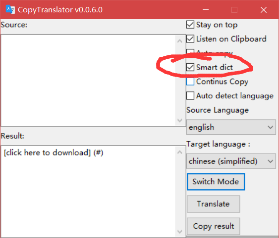
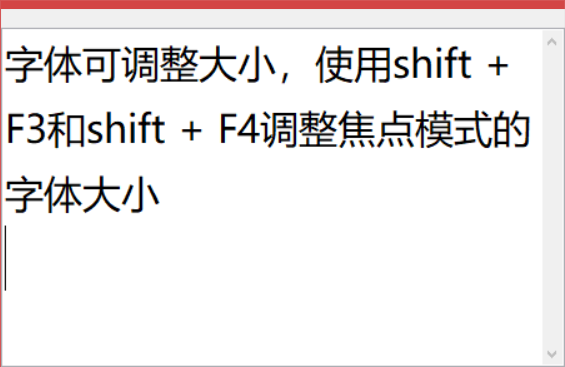
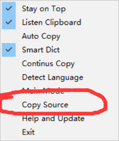

# CopyTranslator 

[英语 English](./README.md)

## Windows用户使用手册
### 公告
**v0.0.5.2版本及以前版本，由于google翻译的机制改变，现在已经无法使用，该问题已在v0.0.5.3之后修复，请大家及时下载更新。**
### 更新日志

#### v0.0.6.0  全面赋能专注模式

[点此下载](#安装)

1. **智能有道词典**（基于Translator](https://github.com/93Alliance/Translator)提供的API）

   单词少于3的句子将被视为短语或单词，您将在专注模式上看到更详细的解释。勾选`Smart Dict`选项以启用它。**注：查词限于有道支持的语言，但是您无需也无法手动选择语言。**

   

   

2. **字体可调整大小**，使用`shift + F3`和`shift + F4`缩小或增大专注模式的字体大小

   

3. **设置记忆**，您的设置将自动保存在磁盘中，并在下次启动时自动重新加载。

4. **连续复制**, 将复制的文本附加到原文而不是替换它，**当段落在不同页面中分隔时尤其有用。**勾选`Continus Copy`选项以启用它。

5. **复制原文**，您可以通过任务栏图标的菜单点击`Copy Source`以在`Auto Copy`模式下暂时复制原文，而不是译文。

   

6. **降低灵敏度**，将点按复制的响应时间增加到0.3秒。

### 简介

**复译：外文辅助阅读翻译解决方案**

复译专门针对英文及中文pdf的换行和句尾做了优化，解决文章断句和换行带来的翻译错误问题，翻译结果更符合中文表达。

由于论文通常以pdf的形式出现，而双栏的pdf（单栏的也可能出现类似现象）在复制的时候又会出现回车(换行)的现象，这使得我们的复制到各种翻译网页后翻译的效果很差，需要我们手动删除换行，才能得到正确的翻译结果。复译提出时主要是为了针对外文pdf的阅读翻译问题，但是并不局限于这个问题，我们发现他在网页翻译，以及其他形式的文本翻译中均表现出色。

以下为直接复制黏贴后的效果，可以看出效果很差，会出现翻译紊乱的情况。

#### 同类产品

虽然金山词霸等工具对于pdf的翻译效果不错，但是在翻译整篇论文的时候，它们存在以下缺点

1. 翻译完后要复制翻译结果较为繁琐，一两句可能还行，但是当我们要翻译整篇文章时，重复性的移动鼠标点选复制也会令人疲倦。
2. 金山词霸在复制翻译结果时同时复制了原文，而我只需要译文，黏贴完后还需要手动删除原文部分，较为繁琐。
3. 翻译结果框出现的位置和大小，时间不固定，有时候会遮挡到原文或者其他的地方，给翻译校对带来不便，此外点选别的地方可能会导致结果框的消失。
4. 此类软件常有广告弹窗 

那么复译是如何解决这些问题呢

1. 当勾选`listen clipboard`后，**复译会自动翻译剪贴板的内容，并显示译文在结果框中。**

2. 只需同时勾选`listen clipboard`及`Auto copy`选项，每次复制翻译后，剪贴板会自动替换原文为译文，直接黏贴即可获得译文。

3. 翻译结果框（专注模式）大小可以自由缩放，并可根据需要选择始终保持在顶部。

### 软件亮点
1. 基本解决PDF复制翻译换行问题
**复译专门针对英文及中文pdf的换行和句尾做了优化，基本解决断句和换行的问题。** 以下为使用复译直接复制翻译后的结果，可以看出翻译效果相比于直接复制黏贴到网页有了巨大的改善。同时，借助于强大的google翻译API，翻译质量有保证，**所使用的translate.google.cn连接速度也较快，无需担心网络问题。**

2. 多段同时翻译，效率更高，同时尽可能保持原有分段。

.

3. **重新定义复译的 复制**  为减少多次按ctrl+c或者是右键复制所带来的麻烦，复译引入一个选中长按自动复制的机制，在打开监听剪贴板选项后，只需选中文字，并将鼠标悬停在选中文字上方**长按不动超过0.1s后释放鼠标（其实0.1s你基本没感觉自己长按了），**也就是**长按后释放**，即可复制。这可以避免我们过度移动鼠标（右键再选择复制）或者是疯狂按ctrl+c按得很累。

   

4. 两种窗口模式可供选择，`主模式`及`专注模式`，专注模式只提供译文窗口，便于您关注结果。使用专注模式时注意勾选`Stay on top`及`Listen clipboard`,必要时应勾选`Auto Copy`。
5. 支持各种语言互译，google翻译支持啥我们就支持啥。
6. 占用内存小，别看安装包挺大， 运行时常驻内存只有十几兆，安装包大是因为打包了python库的问题。

### 项目地址

https://github.com/elliottzheng/CopyTranslator

### 安装

1. 以下列方式下载最新的Windows版本   ：
- 非程序员用户推荐从百度云下载 [https://pan.baidu.com/s/1Lhb6uQK786RMzMjLrDw7fg](https://pan.baidu.com/s/1Lhb6uQK786RMzMjLrDw7fg)
- [Github Releases](https://github.com/elliottzheng/CopyTranslator/releases)。
- [Gitee Releases](https://gitee.com/ylzheng/CopyTranslator/releases)
2. 解压压缩包到任意位置，在程序目录中运行`shortcut.bat`，它会在桌面上创建一个复译的快捷方式。

### 使用

附上我朋友录制的介绍视频链接
[https://www.bilibili.com/video/av31396414/](https://www.bilibili.com/video/av31396414/)

有两种可供选择的模式。

- 主模式
- 专注模式

**您可以通过任务栏图标菜单切换模式。**

**全局热键**: `Shift+F1`，你可以用它来最小化和恢复`CopyTranslator`。(注：可能与部分笔记本电脑快捷键冲突)

**全局热键**: `Shift+F2`，你可以用它在`主模式`和`专注模式`中切换。

#### 主模式

主模式提供了一个交互式框架。

- `Stay on top`：让`CopyTranslator`窗口总是在其他窗口上方。

- `Listen on Clipboard`：监听剪贴板并自动翻译。

- `Auto detect language`：自动检测源文本语言。

- `Auto copy`：如果您想在自动翻译后自动复制结果，请勾选它。

- `Source language`：默认是English。

- `Target language`：默认是简体中文.

- `Switch Mode`: 在主模式和专注模式间切换

  
#### 专注模式

专注模式只提供一个结果窗口，让您更好地关注结果。 （注意选中`Listen on Clipboard`和`Stay on top`选项。）

你可以对它自由拉伸。

- 拖动窗口顶部橙色(你的电脑的主题颜色)区域,或者是边框可以拉伸变形这个窗口；

- 定义**顶部蓝线以上，橙色以下偏灰色区域**为`闪区`

  - 拖动`闪区`可以整体移动窗口

  - 双击`闪区`可以隐藏窗口

  - 右击`闪区`可以复制翻译结果
    

## TODO
- ~~翻译历史~~ 意义不大？如果有兴趣的话可以提issue说明场景，我会考虑是否要加。

## 致谢

感谢[wxpython](https://wxpython.org/), [googletrans](https://github.com/ssut/py-googletrans), [pyperclip](https://github.com/asweigart/pyperclip),[Translator](https://github.com/93Alliance/Translator) 的开发者以及我亲爱的朋友们。

## License

代码采用Mozilla Public License 2.0协议授权。请查阅[LICENSE](https://gitee.com/ylzheng/CopyTranslator/blob/master/LICENSE) 文件，获取更多信息。

## 转载声明
本软件为开源软件，开发者即为博主 [@elliottzheng](https://www.cnblogs.com/elliottzheng/)，软件无任何收费，转发时请附上项目地址

[https://github.com/elliottzheng/CopyTranslator](https://github.com/elliottzheng/CopyTranslator)

此外本人不承担软件二次分发的风险，因此请尽量通过本文提供的下载方式下载。