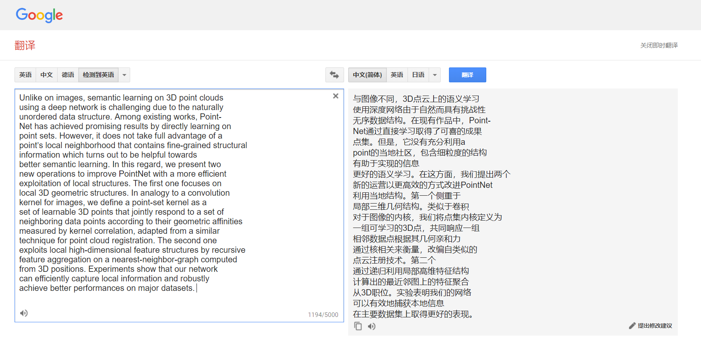
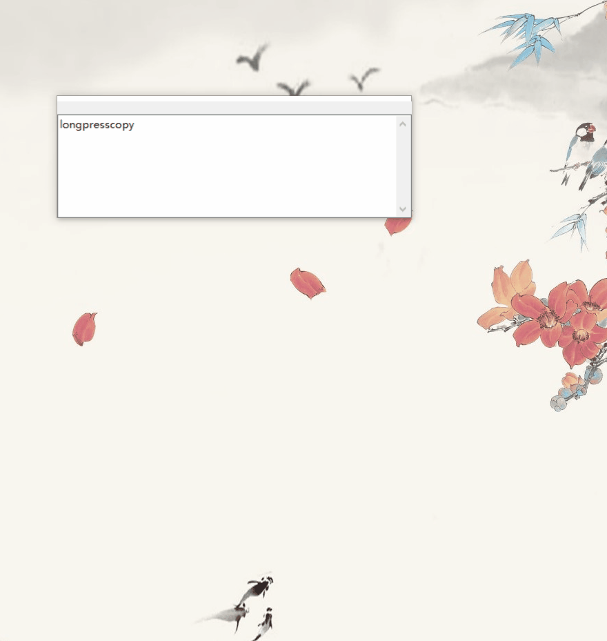
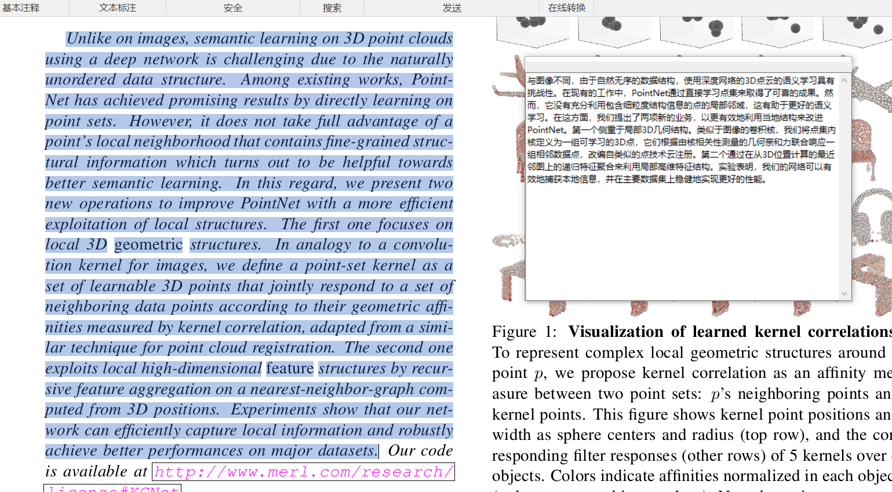

# CopyTranslator 

[英语 English](./README.md)

## Windows用户使用手册

### 简介

**复译：外语论文阅读翻译解决方案**

由于论文通常以pdf的形式出现，而双栏的pdf（单栏的也可能出现类似现象）在复制的时候又会出现回车(换行)的现象，这使得我们的复制到各种翻译网页后翻译的效果很差，需要我们手动删除换行，才能得到正确的翻译结果。复译提出时主要是为了针对外文pdf的阅读翻译问题，但是并不局限于这个问题，我们发现他在网页翻译，以及其他形式的文本翻译中均表现出色。

以下为直接复制黏贴后的效果，可以看出效果很差

#### 同类产品

虽然金山词霸等工具对于pdf的翻译效果不错，但是在翻译整篇论文的时候，它们存在以下缺点

1. 翻译完后要复制翻译结果较为繁琐，一两句可能还行，但是当我们要翻译整篇文章时，重复性的移动鼠标点选复制也会令人疲倦。
2. 金山词霸在复制翻译结果时同时复制了原文，而我只需要译文，黏贴完后还需要手动删除原文部分，较为繁琐。
3. 翻译结果框出现的位置和大小，时间不固定，有时候会遮挡到原文或者其他的地方，给翻译校对带来不便，此外点选别的地方可能会导致结果框的消失。
4. 此类软件常有广告弹窗 

那么复译是如何解决这些问题呢

1. 只需同时勾选`listen clipboard`及`Auto copy`选项，每次复制翻译后，剪贴板会自动替换原文为译文，直接黏贴即可获得译文。

   

2. 翻译结果框（专注模式）大小可以自由缩放，并可根据需要选择始终保持在顶部。

   

### 软件亮点
1. 基本解决PDF复制翻译换行问题
以下为使用复译直接复制翻译后的结果，可以看出翻译效果相比于直接复制黏贴到网页有了巨大的改善。同时，借助于强大的google翻译API，翻译质量有保证。

2. 多段同时翻译

.

3. **重新定义复译的 复制**  为减少多次按ctrl+c或者是右键复制所带来的麻烦，复译引入一个选中长按自动复制的机制，在打开监听剪贴板选项后，只需选中文字，并将鼠标悬停在选中文字上方**长按不动超过0.1s后释放鼠标（其实0.1s你基本没感觉自己长按了），**也就是**长按后释放**，即可复制。这可以避免我们过度移动鼠标（右键再选择复制）或者是疯狂按ctrl+c按得很累。

   

4. 两种窗口模式可供选择，`主模式`及`专注模式`，使用专注模式时注意勾选`Stay on top`及`Listen clipboard`,必要时应勾选`Auto Copy`
5. 支持各种语言互译，google翻译支持啥我们就支持啥
6. 占用内存小，别看安装包挺大， 运行时常驻内存只有十几兆，安装包大是因为打包了python库的问题。

### 项目地址

https://github.com/elliottzheng/CopyTranslator

### 安装
1. 以下列方式下载最新的Windows版本：
- 非程序员用户推荐点击右边的图标从Bintray下载:  
- [Github Releases](https://github.com/elliottzheng/CopyTranslator/releases)。
- [Gitee Releases](https://gitee.com/ylzheng/CopyTranslator/releases)
2. 解压压缩包到任意位置，在程序目录中运行`shortcut.bat`，它会在桌面上创建一个复译的快捷方式。
### 使用
有两种可供选择的模式。

- 主模式
- 专注模式

**您可以通过任务栏图标菜单切换模式。**

**全局热键**: `Shift+F1`，你可以用它来最小化和恢复`CopyTranslator`。(注：可能与部分笔记本电脑快捷键冲突)

**全局热键**: `Shift+F2`，你可以用它在`主模式`和`专注模式`中切换。

#### 主模式

主模式提供了一个交互式框架。

- `Stay on top`：让`CopyTranslator`窗口总是在其他窗口上方。

- `Listen on Clipboard`：监听剪贴板并自动翻译。

- `Auto detect language`：自动检测源文本语言。

- `Auto copy`：如果您想在自动翻译后自动复制结果，请勾选它。

- `Source language`：默认是English。

- `Target language`：默认是简体中文.

- `Switch Mode`: 在主模式和专注模式间切换

  
#### 专注模式

专注模式只提供一个结果窗口，让您更好地关注结果。 （注意选中`Listen on Clipboard`和`Stay on top`选项。）

你可以对它自由拉伸。

- 拖动窗口顶部橙色(你的电脑的主题颜色)区域,或者是边框可以拉伸变形这个窗口；

- 定义**顶部蓝线以上，橙色以下偏灰色区域**为`闪区`

  - 拖动`闪区`可以整体移动窗口

  - 双击`闪区`可以隐藏窗口

  - 右击`闪区`可以复制翻译结果
    

## 致谢

感谢[wxpython](https://wxpython.org/), [googletrans](https://github.com/ssut/py-googletrans), [pyperclip](https://github.com/asweigart/pyperclip) 的开发者以及我亲爱的同学们。

## License

代码采用Mozilla Public License 2.0协议授权。请查阅[LICENSE](./LICENSE) 文件，获取更多信息。
