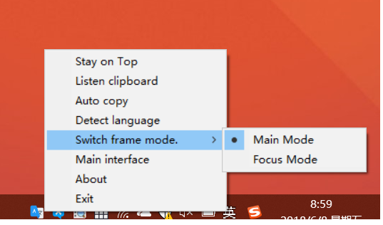
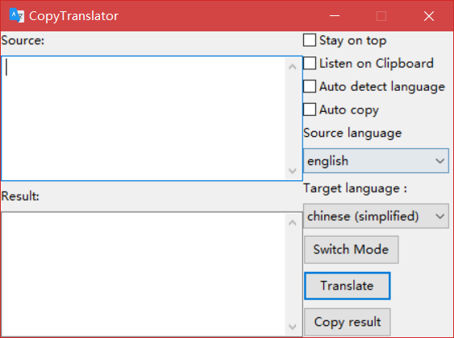
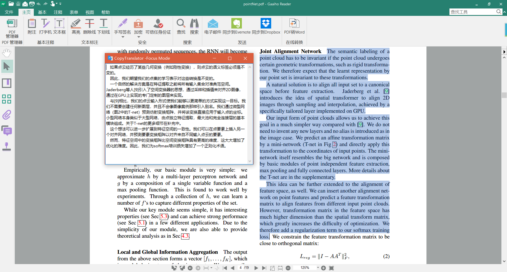

# CopyTranslator 

[英语 English](./README.md)

## Windows用户使用手册

使用Google翻译API复制，翻译和粘贴。

### 项目地址

https://github.com/elliottzheng/CopyTranslator

## v0.0.5.1 的重要更新 

**重新定义CopyTranslator的 Copy，**为减少多次按ctrl+c或者是右键复制所带来的麻烦，CopyTranslator引入一个选中长按自动复制的机制，在打开监听剪贴板选项后，只需选中文字，并将鼠标悬停在选中文字上方**长按不动超过0.1s后释放鼠标（其实0.1s很短的啦），**也就是**长按后释放**，即可复制。这可以避免我们过度移动鼠标（右键再选择复制）或者是疯狂按ctrl+c按得很累。

### 安装
1. 以下列方式下载最新的Windows版本：
- 非程序员用户推荐点击右边的图标从Bintray下载:  
- [Github Releases](https://github.com/elliottzheng/CopyTranslator/releases)。
- [Gitee Releases](https://gitee.com/ylzheng/CopyTranslator/releases)
2. 在程序目录中运行`shortcut.bat`，它会在桌面上创建一个快捷方式。
### 使用
有两种可供选择的模式。

- 主模式
- 专注模式

**您可以通过任务栏图标菜单切换模式。**

**全局热键**: `Shift+F1`，你可以用它来最小化和恢复`CopyTranslator`。(注：可能与部分笔记本电脑快捷键冲突)

**全局热键**: `Shift+F2`，你可以用它在`主模式`和`专注模式`中切换。

#### 主模式

主模式提供了一个交互式框架。

- `Stay on top`：让`CopyTranslator`窗口总是在其他窗口上方。

- `Listen on Clipboard`：监听剪贴板并自动翻译。

- `Auto detect language`：自动检测源文本语言。

- `Auto copy`：如果您想在自动翻译后自动复制结果，请勾选它。

- `Source language`：默认是English。

- `Target language`：默认是简体中文.

- `Switch Mode`: 在主模式和专注模式间切换

  
#### 专注模式

专注模式只提供一个结果窗口，让您更好地关注结果。 （注意选中“Listen on Clipboard”和“Stay on top”选项。）

你可以对它自由拉伸。

- 拖动窗口顶部橙色(你的电脑的主题颜色)区域,或者是边框可以拉伸变形这个窗口；

- 定义**顶部蓝线以上，橙色以下偏灰色区域**为`闪区`

  - 拖动`闪区`可以整体移动窗口

  - 双击`闪区`可以隐藏窗口

  - 右击`闪区`可以复制翻译结果
    

### 亮点
#### 多段同时翻译

.

## 致谢

感谢[wxpython](https://wxpython.org/), [googletrans](https://github.com/ssut/py-googletrans), [pyperclip](https://github.com/asweigart/pyperclip) 的开发者以及我亲爱的同学们。

## License

代码采用Mozilla Public License 2.0协议授权。请查阅[LICENSE](./LICENSE) 文件，获取更多信息。
